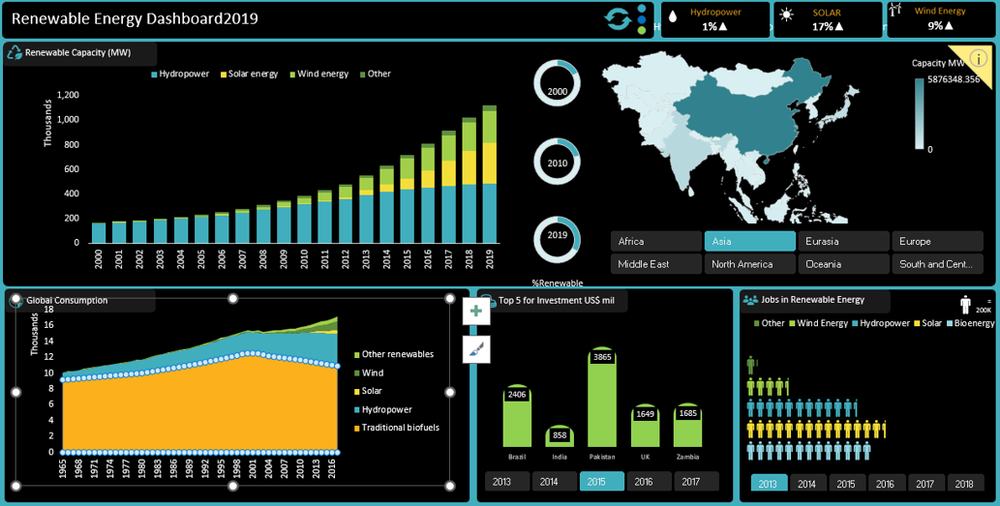

# Renewable Energy Dashboard 2019

## Introduction
This project aims to create a comprehensive dashboard that provides insights into renewable energy data for the year 2019. It involves cleaning and preparing a dataset and the dashboard will feature drill-down capabilities by continent, pivot tables with visualizations on various metrics, and comparisons between renewable and non-renewable energy.
## Objective
The objective is to analyze and visualize the data through various pivot tables and different types of charts and simple macros, culminating in an interactive Excel dashboard that provides valuable insights of Key metrics include electricity capacity, electricity generation, investments, jobs, and consumption.
## Task
1. Data collection, cleaning, and preparation
   
2. Transforming the Table dataset into required format.
 
3. Analyse patterns with PivotTables along with suitable charts.
   
4. Develop compelling reports and visualization
    
5. Create an Interactive dashboard

## Data & Resource Used

**Dataset**

[Kaggle](https://www.kaggle.com/datasets?fileType=csv)

[irena.org](https://www.irena.org/Statistics/View-Data-by-Topic/Finance-and-Investment/Renewable-Energy-Finance-Flows)

And, also the dataset can be found on [Macquarie University](https://www.coursera.org/learn/excel-data-visualization) Coursera Course. I am grateful for both Lecturer guidance on this project.

**Tool** 

Microsoft Excel
## Data Cleaning and Preparation
### 1. Load the Datasets
Checking NULL values, blanks and Errors.

Removing duplicates, and irrelevant columns.

Ensure data consistency and accuracy for analysis..
### 2. Formatting the World Consumption, Jobs Data, and Renewable Investment Tables

Ensure the tables includes all required columns for analysis and visualization.
### 3. Creating a Required Pivot Tables for Visualization
1. Renewable Capacity

2. Capacity by Region

3. Global Consumption

4. Top 5 for Investment

5. Jobs in Renewable Energy

6. Energy Generation

7. Generation vs Renewable Energy Types

8. Capacity Trends by Top 5

## Data Analysis and Visualization
By Creating Pivot Table along with suitable charts we can identify patterns in the dataset.
### Drill-Down Analysis by Continent

**Create a Drill-Down Mechanism:**

o	Enable interactive filters to drill down the data by continent.

o	Ensure seamless navigation between global and continent-level views.
### Renewable Energy Metrics
**Electricity Capacity and Generation Pivot Tables:**

o	Create pivot tables to summarize electricity capacity and generation by year.

o	Add visualizations to represent the data effectively.

**Electricity Capacity by Year:**

o	Summarize electricity capacity data by year (2000, 2010, 2019) using pivot tables.

o	Visualize trends over time.

**Electricity Capacity by Region:**

o	Create pivot tables to show electricity capacity by region.

o	Use visualizations to compare capacity across different regions.
### Investment Analysis by Country

**Summarize Investments:**

o	Create pivot tables to summarize investments in renewable energy by country.

o	Use bar charts or maps to visualize investment distribution.
### Renewable vs. Non-Renewable Electricity Capacity

**Comparison for Selected Years:**

o	Create pivot tables to compare renewable and non-renewable electricity capacity for the years 2000, 2010, and 2019.

o	Use visualizations such as stacked bar charts for comparison.
### Additional Metrics: Jobs and Consumption

**Jobs in Renewable Energy:**

o	Create pivot tables to summarize job data related to renewable energy.

o	Use visualizations to highlight employment trends.

**Energy Consumption:**

o	Summarize energy consumption data.

o	Use visualizations to represent consumption patterns.

## Design Interactive Dashboard 
### 1.	Create a New Worksheet for the Dashboard:
Insert all the created charts into the new worksheet.

Arrange the charts in a logical and visually appealing layout.
### 2.	Add Slicers:
Add slicers for region, and Years.

Ensure all charts are connected to the slicers for interactivity.

And, enable the interactive filters in all charts in Dashboard

### 3.	Add Macros:
Create three macros for Refresh, Drilldown Region in Map, and For Different Themes

## Key Findings
•	**Renewable Capacity:** Solar energy, wind energy, and other are increasing by year on year.

•	**Capacity by Region:** Analysis by Region we can see density of capacity consumption.    

     

•	**Global Consumption:** Maximum contribution is Traditional biofuels in Global Consumption.

•	**Top 5 for Investment:** Analysis of Top 5 for Investment by year Brazil and UK are placed in top. 

•	**Jobs in Renewable Energy:** Geographical distribution of jobs, highest job markets in Solar energy.

## Conclusion
The Renewable Energy Dashboard 2019 provides a comprehensive analysis of World Consumption, Jobs Data, and Renewable Investment, offering valuable insights into Global wise energy consumption & energy generation and Renewable Energy usage cycle. The interactive features of the dashboard, including slicers, and macros enhance the ability to explore the data and derive meaningful conclusions.
## Recommended Analysis
•	Expand the analysis to include additional metrics such as average energy generation and average energy consumption and repeat Investment.

•	Incorporate more advanced visualization techniques to further enhance the dashboard and more macros to reduce the large steps into quick access.

•	Explore predictive analytics to forecast future generation/consumption.
## Reflection
This project provided practical experience in data cleaning, preparation, and analysis using Excel. The creation of an interactive dashboard improved the ability to communicate insights effectively and demonstrated the power of Excel as a tool for data analysis and visualization.
